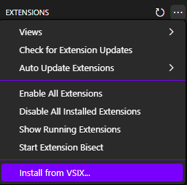
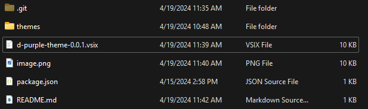
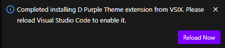

# D-Theme

## How to use

### 1. clone the repository

```bash
git clone https://github.com/Daniel22Pereira/D-Theme.git
```

### 2. go to extensions and click on the three dots and select install from VSIX



### 3. select the file d-purple-theme-0.0.1.vsix



### 4. select reload now



### 5. profit

